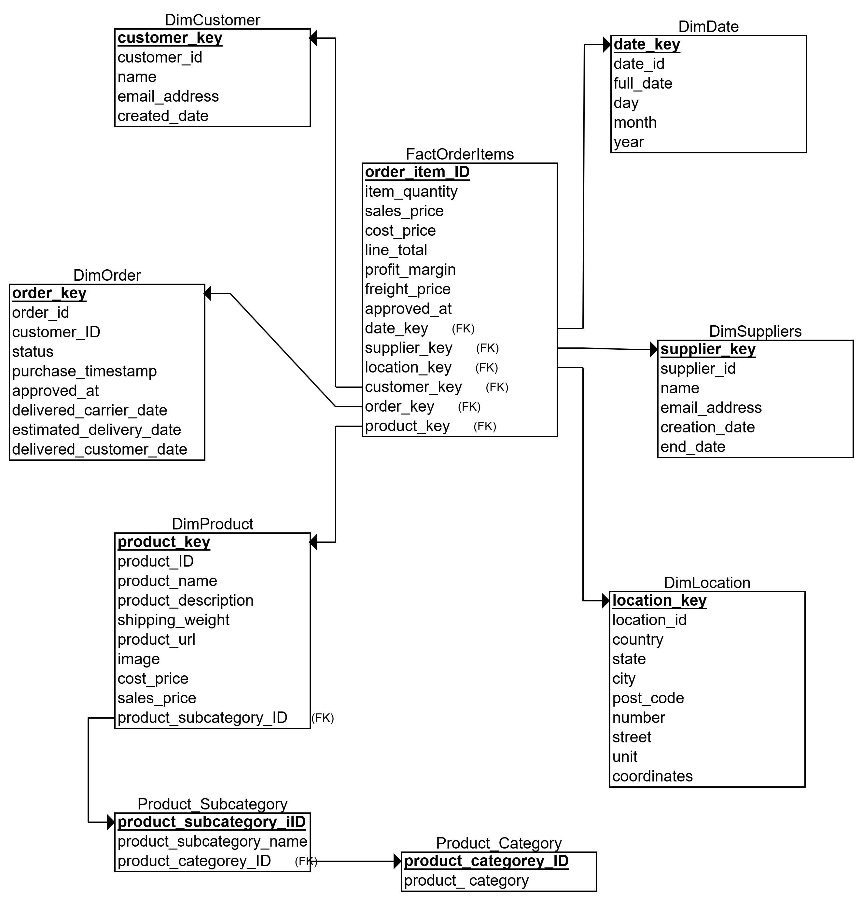
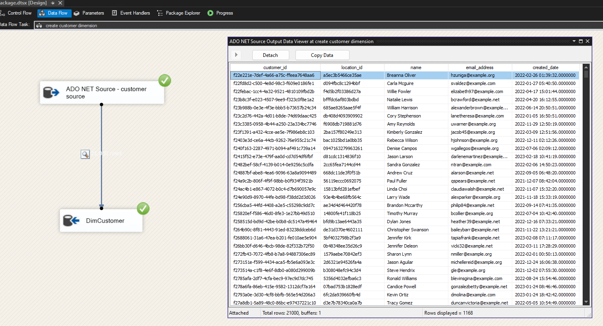
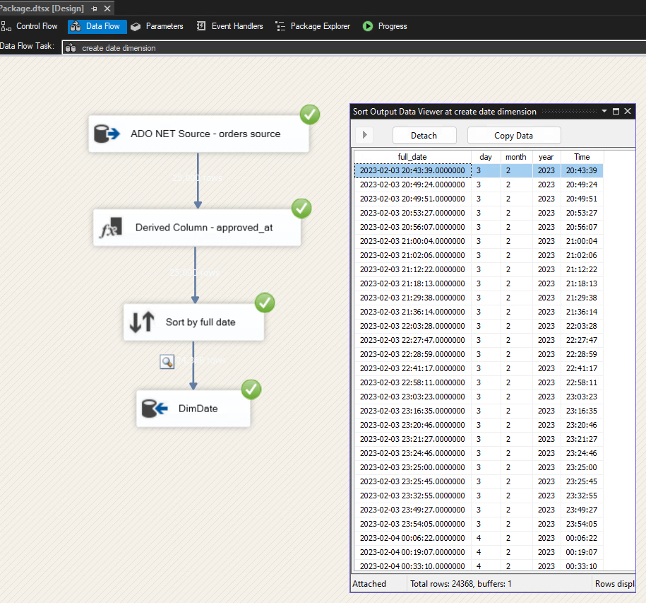
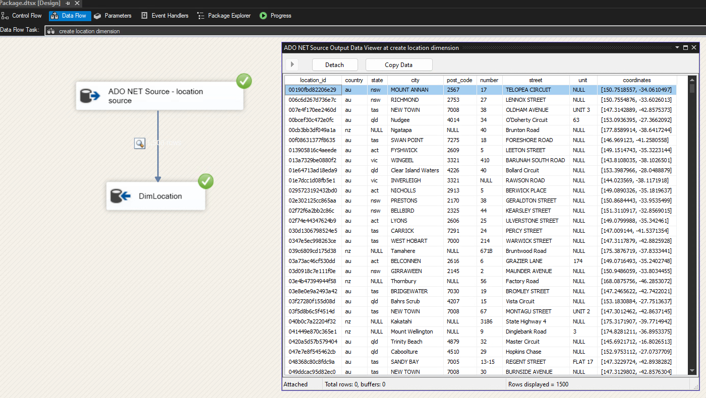
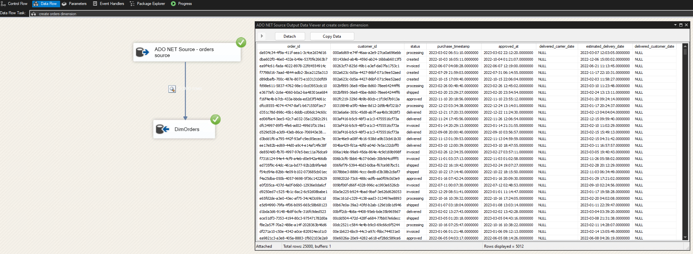
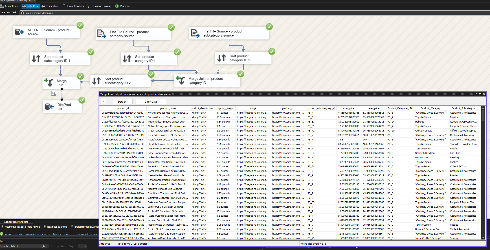
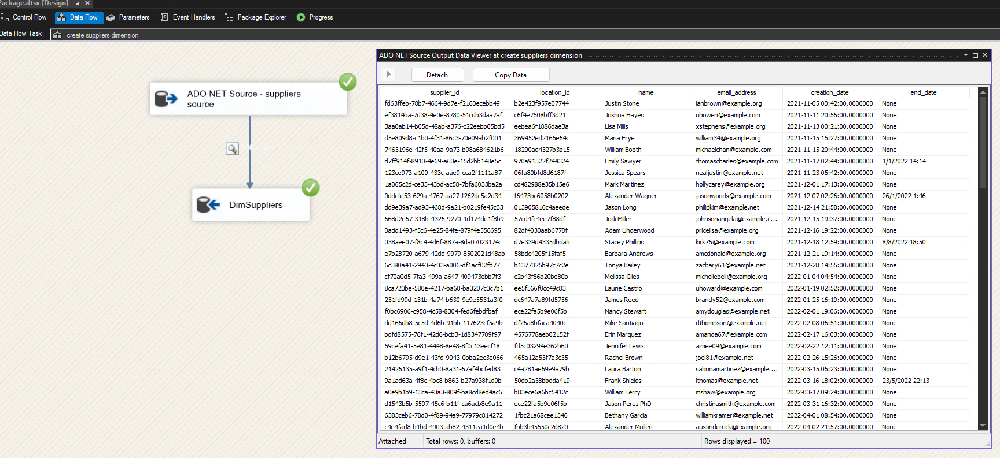
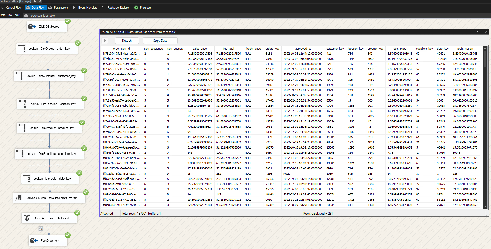

# 🐊 CORS Data Warehouse Project

This project is developed as part of the interview process for a Business Analyst role at Crocoroos’s Online Retail Store (CORS). The objective is to design and implement a data warehouse using sales data provided through Amazon's portal, enabling CORS to make data-driven decisions for operational efficiency and business growth.

---

## 📝 Project Overview

Crocoroos’s Online Retail Store (CORS) is a specialized e-commerce business selling a wide range of products. Due to the limitations of their current transactional systems and the complexity of analyzing sales data in various formats (database and CSV), a dedicated **data warehouse** solution has been proposed.

### Objectives:
- Develop a dimensional data model suitable for business analytics.
- Integrate transactional data using **SQL Server Integration Services (SSIS)**.
- Load the data into a structured data warehouse.
- Run analytical queries to extract valuable business insights.

---

## 📊 Dimensional Model Design

The data warehouse follows a **star schema** model with a central fact table and multiple dimension tables. The granularity of the fact table is at the **order item level**.

### 🌟 Dimensional Model



---

## 🧱 Dimension Tables

### 🧍‍♂️ DimCustomer
Contains information about CORS customers including region and demographic attributes.



---

### 📅 DimDate
A date dimension table used to analyze data over time (daily, monthly, quarterly, yearly).



---

### 📍 DimLocation
Represents geographic data for customers and suppliers to assist in warehouse and logistics planning.



---

### 📦 DimOrders
Captures metadata related to customer orders.



---

### 🎮 DimProduct
Holds product-related data including category and pricing.



---

### 🏭 DimSuppliers
Information about suppliers from whom products are bulk purchased.



---

## 📈 Fact Table

### 🧾 FactOrderItem
Records detailed transaction-level data including sales amount, quantity, discounts, and profit.



---

## ⚙️ ETL Process (SSIS)

Data from Amazon (in CSV and database formats) is extracted, cleaned, transformed, and loaded using **SQL Server Integration Services (SSIS)**. The ETL pipeline:
- Ensures referential integrity with lookup and data conversion tasks.
- Uses derived columns to calculate revenue and profit.
- Populates all dimension and fact tables in the data warehouse.

---

## 📌 Sample Analytical Queries

```sql
-- The five biggest customers in Australia
SELECT TOP 5 c.customer_id, c.name AS customer_name, SUM(f.sales_price * f.item_quantity) AS total_spent
FROM dbo.FactOrderItem f
JOIN dbo.DimCustomer c 
ON f.customer_key = c.customer_key
JOIN dbo.DimLocation l 
ON f.location_key = l.location_key
WHERE l.country = 'au'
GROUP BY c.customer_id, c.name
ORDER BY total_spent DESC;
```

```sql
-- The total monthly revenue from New Zealand
SELECT d.month, d.year, SUM(f.sales_price * f.item_quantity) AS total_monthly_revenue, l.country
FROM dbo.FactOrderItem f
JOIN dbo.DimCustomer c 
ON f.customer_key = c.customer_key
JOIN dbo.DimDate d 
ON f.date_key = d.date_key
JOIN dbo.DimLocation l 
ON f.location_key = l.location_key
WHERE l.country = 'nz'
AND d.month IS NOT NULL
AND d.year IS NOT NULL
GROUP BY d.year, d.month, l.country
ORDER BY d.year, d.month;
```

```sql
-- The most profitable territories over the year
SELECT l.state, SUM(f.profit_margin) AS total_profit
FROM dbo.FactOrderItem f
JOIN dbo.DimLocation l 
ON f.location_key = l.location_key
WHERE l.state IS NOT NULL
GROUP BY l.state
ORDER BY total_profit DESC;
```


### 📦 Technologies Used

- **SQL Server 2019**
- **SSIS in Visual Studio**
- **T-SQL** for querying
- **CSV and ADO.NET** data sources


### 👨‍💼 Author
[yxiao66666](https://www.linkedin.com/in/yang~xiao/) 


